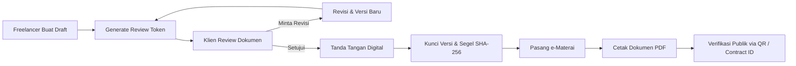

<div align="center">

  

  <br />

  

  <h3>Ubah Chat WhatsApp Menjadi Surat Kesepakatan Kerja Resmi, Rapi, dan Aman</h3>

  <p align="center">
    Platform pencatatan dan manajemen kesepakatan kerja digital untuk freelancer & klien di Indonesia.<br />
    Lengkap dengan <strong>e-Materai</strong>, <strong>tanda tangan online</strong>, <strong>segel integritas SHA-256</strong>, dan <strong>verifikasi publik QR</strong>.
  </p>

  <p align="center">
    <a href="https://github.com/FadliBilal/sepakatin/stargazers"></a>
    <a href="https://github.com/FadliBilal/sepakatin/network/members"></a>
    <a href="https://github.com/FadliBilal/sepakatin/blob/main/LICENSE"></a>
    <a href="https://nextjs.org/"></a>
    <a href="https://www.typescriptlang.org/"></a>
    <a href="https://supabase.com/"></a>
  </p>

  <p align="center">
    <a href="#-fitur-unggulan">Fitur Unggulan</a> •
    <a href="#-alur-kerja-produk">Alur Kerja</a> •
    <a href="#-arsitektur--teknologi">Teknologi</a> •
    <a href="#-akun-demo-untuk-pengujian">Akun Demo</a> •
    <a href="#-instalasi--menjalankan">Panduan Instalasi</a> •
    <a href="#-modul-admin-panel">Admin Panel</a> •
    <a href="#-deploy-ke-vercel">Deploy</a>
  </p>

</div>

---

## 📌 Latar Belakang & Masalah

Di ekosistem pekerja lepas (freelancer) digital Indonesia, kesepakatan proyek hampir selalu dilakukan via chat instan (WhatsApp/Telegram/Email):
- ❌ Ruang lingkup kerja (scope) sering bergeser di tengah jalan (*scope creep*) tanpa tambahan biaya.
- ❌ Batasan revisi tidak disepakati secara tertulis sejak awal.
- ❌ Tanggal jatuh tempo dan skema pembayaran termin/DP sering memicu perselisihan.
- ❌ Bukti obrolan chat sulit dilacak dan tidak memiliki validitas integritas dokumen.

> **Sepakatin hadir sebagai *single source of truth* kesepakatan kerja:** bukan sekadar generator template kontrak, melainkan platform manajemen siklus kesepakatan kerja yang mengubah deal obrolan menjadi dokumen sah, terstruktur, disetujui bersama, dan dapat diverifikasi keasliannya oleh siapa saja.

---

## ✨ Fitur Unggulan

| Fitur | Deskripsi |
| :--- | :--- |
| **📝 Smart Agreement Builder** | Formulir terstruktur mencakup ruang lingkup, kriteria penerimaan, skema pembayaran (DP & termin), batasan revisi, klausul hak cipta (HKI), dan terminasi. |
| **🔗 Frictionless Client Review** | Klien menerima tautan peninjauan unik berbasis token tanpa dipaksa melalui proses registrasi akun yang rumit. |
| **✍️ Digital Canvas Signature** | Pad tanda tangan interaktif berbasis vektor SVG untuk freelancer dan klien. |
| **🔖 e-Materai Resmi Simulation** | Penempelan meterai elektronik Rp 10.000 dengan nomor seri unik (SN) dan stempel Peruri/DJP RI yang presisi. |
| **🖨️ Pixel-Perfect A4 Print & PDF** | Tata letak dokumen cetak resmi berskala A4 portrait dengan margin standar (18mm/16mm) dan proteksi pemotongan halaman (`page-break`). |
| **🔒 SHA-256 Tamper-Proof Seal** | Dokumen yang disetujui dikunci dengan perhitungan canonical JSON hash SHA-256. Setiap perubahan sepihak otomatis terdeteksi *MISMATCH*. |
| **📱 Dynamic Verification QR Code** | Setiap dokumen memuat QR Code unik yang mengarah ke halaman verifikasi publik (`/verify/[contract_id]`). |
| **🛡️ Comprehensive Admin Panel** | Dasbor pengelola platform (`/admin`) untuk memantau metrik bisnis, manajemen paket pengguna, dan moderasi dokumen. |

---

## 🔄 Alur Kerja Produk



1. **Drafting**: Freelancer mengisi detail proyek, nilai kontrak, DP, termin, dan klausul revisi.
2. **Kirim ke Klien**: Freelancer membagikan tautan undangan review via WhatsApp/email.
3. **Negosiasi & Persetujuan**: Klien dapat langsung menyetujui atau mengajukan *Change Request*.
4. **Penguncian Dokumen**: Saat kedua pihak menyetujui, status berubah menjadi `AGREED` dan isi kontrak bersifat *immutable* (tidak dapat diubah).
5. **Verifikasi**: Siapa pun dapat memindai QR code pada fisik surat untuk memeriksa keasliannya di `/verify`.

---

## 👥 Akun Demo untuk Pengujian

Aplikasi telah dilengkapi dengan **3 akun bawaan** untuk memudahkan penguji dan juri mencoba seluruh alur kerja dalam 1 klik:

| Peran Akun | Username / Email | Kata Sandi | Status Paket | Kegunaan Pengujian |
| :--- | :--- | :--- | :---: | :--- |
| **Freelancer Pro** | `fadli` / `fadli@sepakatin.id` | `sepakatin123` | **⭐ Pro** | Sudah memiliki contoh dokumen kesepakatan resmi (`SPK-2026-00124`) yang lengkap dengan e-Materai, tanda tangan, dan segel hash. |
| **Freelancer Baru** | `demo` / `demo@sepakatin.id` | `demo1234` | **Gratis** (+3 kredit) | Akun kosong untuk menguji alur pembuatan kesepakatan baru dari awal hingga pengiriman ke klien. |
| **Administrator** | `admin` / `admin@sepakatin.id` | `admin123` | **🛡️ Admin** | Akses penuh ke **Panel Admin (`/admin`)** untuk melihat analitik platform, memoderasi kontrak, dan mengubah paket pengguna. |

> 💡 *Di halaman login (`/auth/login`), terdapat tombol cepat **"Pakai"** untuk masing-masing akun di atas tanpa perlu mengetik manual.*

---

## 🛡️ Modul Admin Panel (`/admin`)

Khusus untuk pengelola platform, modul Admin menyediakan kontrol operasional hulu ke hilir:
- **Ikhtisar Platform**: Metrik real-time total pengguna, total kesepakatan, volume transaksi proyek (IDR), dan status konektivitas database.
- **Manajemen Pengguna**: Tabel daftar seluruh pengguna dengan tombol aksi cepat untuk melakukan upgrade paket ke **Pro** atau menambah kuota **Kredit Proyek**.
- **Moderasi Kesepakatan**: Mengaudit semua dokumen yang dibuat di platform, mencocokkan status integritas hash SHA-256, dan opsi pembatalan jika terdeteksi penyalahgunaan.
- **Pengaturan & Cloud**: Pemantauan status Supabase Cloud, variabel `.env.local`, dan kontak layanan pelanggan.

---

## 💻 Arsitektur & Teknologi

Sepakatin dibangun dengan arsitektur modern yang memprioritaskan performa tinggi, keamanan tipe data, dan kemudahan deployment:

```text
sepakatin/
├── app/                        # Next.js App Router
│   ├── admin/                  # Dasbor Administrator Platform
│   ├── agreements/             # Manajemen Kesepakatan, Pembuatan Baru & Versi Cetak
│   ├── api/                    # Serverless API Endpoints (Service Role & Logic)
│   ├── auth/                   # Autentikasi (Login & Registrasi)
│   ├── review/                 # Peninjauan Dokumen oleh Klien (Token-based)
│   ├── verify/                 # Halaman Publik Cek Keaslian Dokumen & Hash
│   ├── layout.tsx              # Root Layout, SEO, Metadata & Favicon
│   └── page.tsx                # Landing Page & Animasi 3D
├── components/                 # Reusable UI Components
│   ├── PrintableAgreement.tsx  # Layout Cetak Dokumen A4 Resmi
│   ├── SignaturePad.tsx        # Kanvas Tanda Tangan Digital
│   ├── QRCodeViewer.tsx        # Penampil QR Code Verifikasi
│   └── Navbar.tsx & Footer.tsx # Navigasi Konsisten
├── lib/                        # Core Business Logic & State
│   ├── agreement-logic.ts      # Aturan Bisnis Lifecycle Kesepakatan
│   ├── auth.ts                 # Sesi & Dual-Mode Auth (Local/Supabase)
│   ├── crypto.ts               # Canonical SHA-256 Integrity Hasher
│   ├── plans.ts                # Aturan Paket & Batasan Kuota
│   └── store.ts                # Akses Data Terpadu (Dual-Mode Local & API)
├── public/                     # Static Assets (Logo, Favicon, 3D GIF)
└── supabase/                   # Skema Database PostgreSQL & RLS Policies
```

- **Framework**: [Next.js 14](https://nextjs.org/) (App Router, Server Components & Client Hooks)
- **Language**: [TypeScript](https://www.typescriptlang.org/) (Strict Type-Safety)
- **Styling**: [Tailwind CSS](https://tailwindcss.com/) dengan modul kustom `@layer components`
- **Icons**: [Lucide React](https://lucide.dev/)
- **Kriptografi**: Web Crypto API (SHA-256 Canonical JSON hashing)
- **Database & Auth (Cloud)**: [Supabase](https://supabase.com/) (PostgreSQL + Row-Level Security)
- **Fallback Engine**: LocalStorage Reactive Store (Langsung berjalan mulus tanpa konfigurasi database eksternal)

---

## 🚀 Instalasi & Menjalankan

### 1. Kloning Repositori
```bash
git clone https://github.com/FadliBilal/sepakatin.git
cd sepakatin
```

### 2. Instal Dependensi
```bash
npm install
```

### 3. Jalankan Server Pengembangan
```bash
npm run dev
```
Buka browser di **[http://localhost:3000](http://localhost:3000)**.

### 4. Build untuk Produksi
```bash
npm run build
npm run start
```

---

## ⚙️ Konfigurasi Environment (Opsional)

Sepakatin dapat langsung berjalan **100% secara offline / mode lokal** menggunakan penyimpanan browser. Jika Anda ingin menghubungkannya ke **Supabase Cloud**, buat file `.env.local` di root proyek:

```env
# URL publik aplikasi Anda
NEXT_PUBLIC_APP_URL=http://localhost:3000

# Konfigurasi Supabase Cloud (ambil dari Project Settings -> API)
NEXT_PUBLIC_SUPABASE_URL=https://your-project.supabase.co
NEXT_PUBLIC_SUPABASE_ANON_KEY=your-anon-public-key
SUPABASE_SERVICE_ROLE_KEY=your-service-role-secret-key

# Secret untuk dev seed (opsional)
SEED_SECRET=sepakatin_secret_2026
```

> **Catatan Database**: Jalankan skrip SQL yang tersedia di [`supabase/migrations/001_initial_schema.sql`](supabase/migrations/001_initial_schema.sql) pada **SQL Editor** Supabase Anda untuk mengaktifkan seluruh tabel, fungsi kredit, dan kebijakan keamanan *Row-Level Security* (RLS).

---

## ☁️ Deploy ke Vercel

Aplikasi ini dioptimalkan untuk deployment instan di platform **Vercel**:

1. Fork atau push repositori ini ke akun GitHub Anda.
2. Buka [Vercel Dashboard](https://vercel.com/) dan pilih **"Add New..." → "Project"**.
3. Import repositori **`sepakatin`**.
4. *(Opsional)* Tambahkan Environment Variables jika menggunakan database Supabase.
5. Klik **"Deploy"**. Vercel akan mengompilasi aplikasi dan menyediakan URL publik aktif.

---

## ⚖️ Pernyataan Hukum & Batasan Tanggung Jawab

Sepakatin adalah platform pencatatan dan manajemen kesepakatan kerja digital, bukan firma hukum, kantor advokat, atau penyedia nasihat hukum formal. Integritas hash dokumen dan e-Materai pada platform dirancang sebagai alat bukti persetujuan para pihak dan penjaga integritas data kesepakatan.

---

## 📄 Lisensi

Didistribusikan di bawah Lisensi MIT. Lihat file [`LICENSE`](LICENSE) untuk informasi lebih lanjut.

---

<div align="center">
  <p>Dibuat dengan ❤️ untuk kemajuan ekosistem freelancer digital Indonesia.</p>
  <p>© 2026 Sepakatin. Hak Cipta Dilindungi.</p>
</div>
